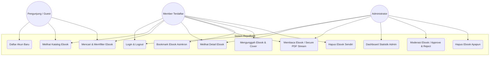
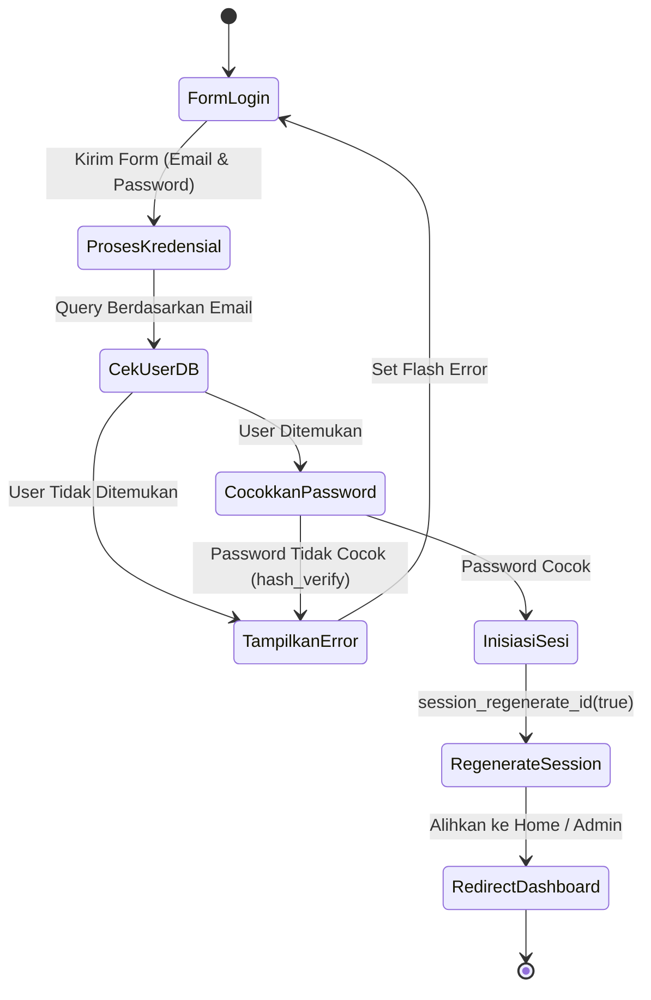
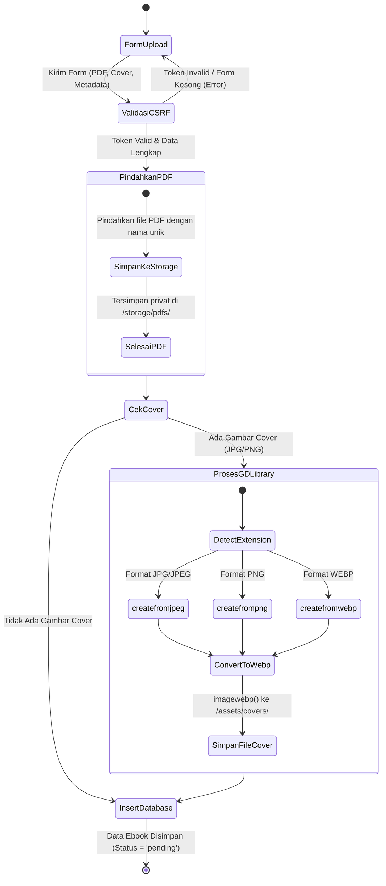
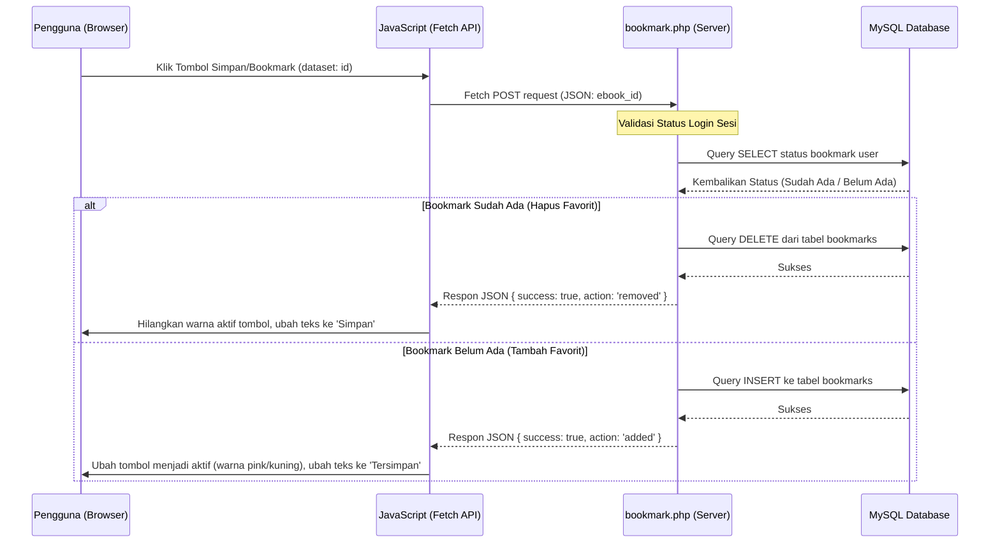
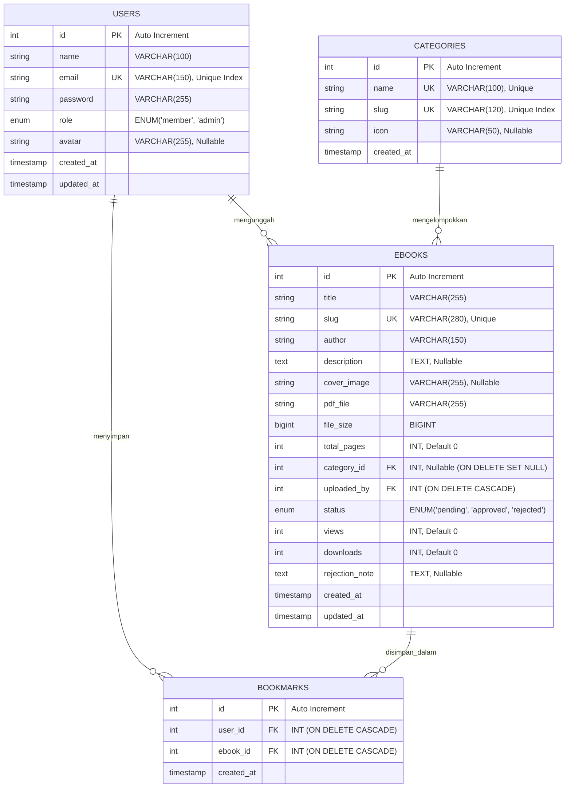

# LAPORAN TUGAS AKHIR
## Praktikum Pemrograman Web - Kelas B

<br>

<p align="center">
  <strong style="font-size: 16pt;">SISTEM REPOSITORY EBOOK (REPOBOOK)</strong>
</p>

<br>

<p align="center">
  <strong>Disusun oleh:</strong><br>
  Atnan Septian Wijarnako &nbsp;&nbsp;&nbsp;&nbsp;&nbsp;&nbsp;&nbsp;&nbsp; L200240079<br>
  Zahrah Nur Rahmah &nbsp;&nbsp;&nbsp;&nbsp;&nbsp;&nbsp;&nbsp;&nbsp;&nbsp;&nbsp;&nbsp;&nbsp; L200240083<br>
  Sandy Matin Falah &nbsp;&nbsp;&nbsp;&nbsp;&nbsp;&nbsp;&nbsp;&nbsp;&nbsp;&nbsp;&nbsp;&nbsp;&nbsp;&nbsp;&nbsp;&nbsp; L200240052<br>
  Thoriq Fahma Amin &nbsp;&nbsp;&nbsp;&nbsp;&nbsp;&nbsp;&nbsp;&nbsp;&nbsp;&nbsp;&nbsp;&nbsp;&nbsp;&nbsp; L200240061
</p>

<br>

<p align="center">
  <strong>TEKNIK INFORMATIKA</strong><br>
  <strong>FAKULTAS KOMUNIKASI DAN INFORMATIKA</strong><br>
  <strong>UNIVERSITAS MUHAMMADIYAH SURAKARTA</strong><br>
  <strong>2025/2026</strong>
</p>

---

### Identitas Proyek
* **Judul Proyek**: Sistem Repository Ebook (RepoBook)
* **Nama Kelompok**:
  1. Atnan Septian Wijarnako – L200240079
  2. Zahrah Nur Rahmah – L200240083
  3. Sandy Matin Falah – L200240052
  4. Thoriq Fahma Amin – L200240061
* **Dosen Pengampu**: Faris Atoil Haq, S.Tr.T., M.Kom.

---

### Tools Yang Digunakan
* **Bahasa Pemrograman**: PHP 8+ (Native dengan PDO), JavaScript (ES6+ & Fetch API)
* **Database**: MySQL / MariaDB (Engine InnoDB, fulltext search, relational index)
* **Markup & Desain Antarmuka**: HTML5, CSS3 Murni (Vanilla CSS dengan CSS Variables)
* **Library Ekstensi**: PHP GD Library (Pemrosesan gambar otomatis ke format WebP)
* **Peralatan Server**: XAMPP (Apache, MySQL) / Docker Containerization (Apache-PHP, phpMyAdmin)
* **Editor Kode**: VS Code & Antigravity IDE

---

### Penjelasan Sistem
Sistem Repository Ebook (**RepoBook**) adalah aplikasi berbasis web yang dirancang khusus untuk menyimpan, mengelola, dan mendistribusikan buku elektronik (ebook) dalam format PDF secara aman dan efisien. Sistem ini menyediakan katalog ebook dinamis yang dikelompokkan berdasarkan kategori, dilengkapi dengan fitur pencarian teks dan filter kategori. 

Keunggulan utama RepoBook terletak pada tiga pilar fungsionalnya:
1. **Keamanan File**: Ebook PDF yang diunggah disimpan di direktori privat yang dilindungi oleh konfigurasi `.htaccess`, mencegah akses unduh langsung (*direct download bypass*). File hanya dapat dibaca melalui mekanisme streaming biner PHP yang memverifikasi hak sesi pengguna.
2. **Optimasi Penyimpanan**: Gambar cover buku yang diunggah oleh pengguna (format JPG atau PNG) akan dikonversi secara otomatis oleh server backend menjadi format WebP modern sebelum disimpan untuk menghemat ruang penyimpanan server hingga 70% dan meningkatkan performa pemuatan halaman.
3. **Alur Kerja Kolaboratif**: Pengguna umum (member) dapat berkontribusi dengan mengunggah ebook, yang kemudian masuk ke dalam antrean moderasi. Administrator memegang kendali penuh melalui dashboard khusus untuk menyetujui (*approve*) atau menolak (*reject*) ebook tersebut sebelum dipublikasikan ke katalog publik.

---

### Pembagian Job
| Nama Anggota | NIM | Tugas / Peran Utama | Rincian Pekerjaan |
| :--- | :--- | :--- | :--- |
| **Atnan Septian Wijarnako** | L200240079 | Logika Penyimpanan, Backend & Keamanan | - Merancang dan mengimplementasikan mekanisme secure PDF streaming (`read.php`).<br>- Membuat fungsi konversi otomatis cover buku JPG/PNG ke WebP menggunakan PHP GD Library (`upload.php`).<br>- Mengatur sistem otentikasi sesi, token CSRF, proteksi XSS, dan konfigurasi keamanan folder `.htaccess`. |
| **Zahrah Nur Rahmah** | L200240083 | Perancangan Database & Query SQL | - Merancang struktur tabel database (`users`, `categories`, `ebooks`, `bookmarks`).<br>- Membuat skema DDL/DML, relasi kunci asing (*Foreign Keys*) dengan batasan cascade, serta indeks optimasi pencarian fulltext.<br>- Menyusun query SQL CRUD dengan PDO Prepared Statements. |
| **Sandy Matin Falah** | L200240052 | Frontend & Desain UI/UX (Layout) | - Menyusun struktur visual dan layout utama aplikasi (`app-layout`, `main-wrapper`).<br>- Merancang desain responsif dengan CSS variables, palet warna *Warm Amber*, tipografi modern (Inter & Playfair Display), serta efek mikro-animasi pada grid katalog buku. |
| **Thoriq Fahma Amin** | L200240061 | Frontend & Integrasi AJAX | - Membuat logika menu hamburger responsif dan kontrol sidebar pada perangkat tablet/mobile.<br>- Mengintegrasikan fitur bookmark/favorit secara asinkron menggunakan Fetch API (`bookmark.php` & `app.js`) sehingga data ter-update real-time tanpa reload halaman.<br>- Merancang interface dinamis untuk formulir pengunggahan file (*drag & drop area*). |

---

### Kegiatan / Pengembangan Fitur

#### 1. Use Case Diagram
Use Case Diagram menjelaskan peran aktor (Guest, Member, Admin) dan interaksi mereka dengan modul sistem.



**Deskripsi Aktor & Use Case**:
* **Pengunjung (Guest)**: Aktor umum yang belum terautentikasi. Hanya diizinkan melihat katalog umum, mencari buku berdasarkan judul/penulis, menyaring berdasarkan kategori, serta melakukan pendaftaran akun baru.
* **Member**: Aktor pengguna yang telah terdaftar. Memiliki hak akses penuh untuk membaca ebook via PDF streaming, menandai buku favorit (bookmark), mengunggah ebook baru (yang akan diproses lewat konversi WebP otomatis), serta menghapus buku unggahan pribadinya.
* **Administrator**: Aktor pengelola sistem. Memiliki akses ke dashboard statistik (melihat jumlah pengguna, total buku disetujui, dan antrean moderasi) serta memoderasi unggahan member (menyetujui atau menolak buku baru).

---

#### 2. Activity Diagram
Bagian ini menerangkan alur aktivitas dari beberapa proses inti dalam sistem RepoBook:

##### A. Alur Login Sistem
Menggambarkan alur otentikasi pengguna (member/admin) dari proses input kredensial hingga pembuatan sesi.



##### B. Alur Upload Ebook & Konversi Gambar Otomatis
Menggambarkan logika penyimpanan yang dirancang oleh Atnan Septian, di mana server memproses file PDF secara aman dan mengonversi cover buku menjadi format WebP menggunakan ekstensi GD Library PHP.



##### C. Alur Bookmark Favorit (AJAX)
Menjelaskan integrasi AJAX (Fetch API) asinkron yang dikembangkan oleh Thoriq Fahma Amin untuk menambah/menghapus bookmark secara instan tanpa perlu me-reload halaman.



---

#### 3. ERD (Entity Relationship Diagram)
Skema database yang dirancang oleh Zahrah Nur Rahmah terdiri dari empat tabel relasional utama yang menjamin integritas data (data integrity) dengan foreign keys berkekuatan cascade.



**Deskripsi Struktur Relasi**:
1. **Relasi Users ke Ebooks (One-to-Many)**: Satu pengguna (*users*) dapat mengunggah banyak buku (*ebooks*), namun satu buku diunggah oleh tepat satu pengguna melalui kunci asing `ebooks.uploaded_by` yang merujuk pada `users.id`.
2. **Relasi Categories ke Ebooks (One-to-Many)**: Satu kategori (*categories*) dapat mengelompokkan banyak buku (*ebooks*). Jika kategori dihapus, kolom `ebooks.category_id` otomatis diubah menjadi `NULL` (*ON DELETE SET NULL*) agar buku tidak terhapus.
3. **Relasi Bookmarks (Tabel Penghubung Many-to-Many)**: Menghubungkan tabel `users` dan `ebooks` secara tidak langsung. Kunci unik gabungan `uq_bookmark (user_id, ebook_id)` dipasang untuk mencegah pengguna menandai buku yang sama lebih dari satu kali.

---

#### 4. Design UI/UX
Desain antarmuka RepoBook yang dibangun oleh Sandy Matin Falah memprioritaskan estetika premium, kenyamanan membaca, serta keramahan perangkat (responsiveness).

* **Palet Warna Hangat (Warm Amber Aesthetic)**: Terinspirasi oleh warna kertas buku klasik, palet warna didefinisikan menggunakan variabel CSS murni untuk konsistensi seluruh aplikasi:
  * Warna Primer: `#D4872C` (Cokelat Keemasan) yang memberi aksen buku premium.
  * Latar Belakang Utama: `#FDF6EC` (Krem Lembut) yang mengurangi kelelahan mata.
  * Kartu & Permukaan: `#FFFFFF` dengan bayangan lembut bernuansa kecokelatan (`rgba(180, 160, 130, 0.1)`).
* **Tipografi Elegan**:
  * Heading dan Judul menggunakan font serif **Playfair Display** untuk menampilkan nuansa akademis dan sastra klasik.
  * Teks isi menggunakan font sans-serif **Inter** demi akurasi visual antarmuka dan keterbacaan yang tinggi pada berbagai ukuran layar.
* **Tata Letak Layout Dinamis**:
  * **Sidebar Lipat (Responsive Sidebar)**: Pada resolusi desktop (>1024px) sidebar melebar penuh (260px). Pada layar tablet (768px - 1024px) sidebar otomatis menciut menjadi 72px (hanya menampilkan ikon). Pada resolusi mobile (<768px), sidebar disembunyikan di luar layar dan dapat dimunculkan melalui efek geser (slide-out drawer) dengan menekan tombol hamburger.
  * **Katalog & Hero**: Bagian atas katalog memuat *Hero Section* berupa banner besar gradasi hangat berisi daftar buku best-seller terpopuler dengan micro-interaction berupa transisi skala hover (`transform: translateY(-5px) scale(1.03)`).
  * **Halaman Detail Ebook**: Menampilkan visualisasi cover buku di sebelah kiri dengan bayangan proyeksi 3D dan detail deskripsi sinopsis, ukuran file, jumlah pembaca, serta tombol aksi di sebelah kanan.

---

#### 5. Code
Berikut adalah dokumentasi penulisan kode program utama yang digunakan untuk membangun fitur-fitur kritis pada RepoBook:

##### A. Logika Koneksi Database (Pattern Singleton - `config/database.php`)
Dirancang untuk efisiensi instansiasi database PDO dan pencegahan kebocoran memori.
```php
class Database
{
    private static ?PDO $instance = null;

    public static function getConnection(): PDO
    {
        if (self::$instance === null) {
            $dsn = sprintf(
                'mysql:host=%s;port=%s;dbname=%s;charset=%s',
                DB_HOST, DB_PORT, DB_NAME, 'utf8mb4'
            );

            $options = [
                PDO::ATTR_ERRMODE            => PDO::ERRMODE_EXCEPTION,
                PDO::ATTR_DEFAULT_FETCH_MODE => PDO::FETCH_ASSOC,
                PDO::ATTR_EMULATE_PREPARES   => false, // Keamanan SQL Injection maksimal
                PDO::MYSQL_ATTR_INIT_COMMAND => "SET NAMES utf8mb4",
            ];

            try {
                self::$instance = new PDO($dsn, DB_USER, DB_PASS, $options);
            } catch (PDOException $e) {
                error_log('Database Connection Error: ' . $e->getMessage());
                die('Koneksi Database Gagal.');
            }
        }
        return self::$instance;
    }

    public static function connect(): PDO
    {
        return self::getConnection();
    }
}
```

##### B. Logika Secure PDF Streaming (`public/read.php`)
Logika penyimpanan backend buatan Atnan Septian untuk membaca file PDF secara aman tanpa mengekspos letak file fisik asli ke publik.
```php
// File PDF tersimpan secara aman di luar jangkauan url publik (/storage/pdfs/)
$filePath = PDF_STORAGE . '/' . $book['pdf_file'];

if (!file_exists($filePath)) {
    die("File PDF tidak ditemukan di server.");
}

// Catat jumlah bacaan/download satu kali per sesi
if (!isset($_SESSION['read_' . $id]) && !isAdmin()) {
    $db->prepare("UPDATE ebooks SET downloads = downloads + 1 WHERE id = :id")->execute([':id' => $id]);
    $_SESSION['read_' . $id] = true;
}

// Stream file langsung ke browser tanpa memberikan direct link download
header('Content-Type: application/pdf');
header('Content-Disposition: inline; filename="' . basename($book['title']) . '.pdf"');
header('Content-Transfer-Encoding: binary');
header('Accept-Ranges: bytes');
header('Content-Length: ' . filesize($filePath));
@readfile($filePath);
exit;
```

##### C. Konversi Otomatis Cover Buku ke WebP (`public/upload.php`)
Logika optimasi gambar pada proses pengunggahan buku.
```php
// Auto convert gambar JPG/PNG menjadi WebP menggunakan GD Library
$image = false;
if (in_array($imgExt, ['jpg', 'jpeg'])) {
    $image = @imagecreatefromjpeg($coverTmpPath);
} elseif ($imgExt === 'png') {
    $image = @imagecreatefrompng($coverTmpPath);
    if ($image) {
        imagepalettetotruecolor($image);
        imagealphablending($image, true);
        imagesavealpha($image, true);
    }
} elseif ($imgExt === 'webp') {
    $image = @imagecreatefromwebp($coverTmpPath);
}

if ($image !== false) {
    imagewebp($image, $coverDestPath, 85); // Konversi ke format webp dengan kualitas 85%
    imagedestroy($image);
} else {
    // Fallback jika GD library tidak aktif
    move_uploaded_file($coverTmpPath, $coverDestPath);
}
```

##### D. Endpoint AJAX Bookmark (`public/bookmark.php`)
Memproses permintaan bookmark dari JavaScript Fetch API secara asinkron.
```php
// Baca input JSON dari client
$data = json_decode(file_get_contents('php://input'), true);
$ebookId = isset($data['ebook_id']) ? (int)$data['ebook_id'] : 0;

if ($ebookId <= 0 || !isLoggedIn()) {
    echo json_encode(['success' => false, 'message' => 'Akses ditolak']);
    exit;
}

$db = Database::connect();
$stmt = $db->prepare("SELECT id FROM bookmarks WHERE user_id = :uid AND ebook_id = :eid");
$stmt->execute([':uid' => $_SESSION['user_id'], ':eid' => $ebookId]);
$bookmark = $stmt->fetch();

if ($bookmark) {
    // Hapus bookmark
    $db->prepare("DELETE FROM bookmarks WHERE id = :id")->execute([':id' => $bookmark['id']]);
    echo json_encode(['success' => true, 'action' => 'removed']);
} else {
    // Tambah bookmark baru
    $db->prepare("INSERT INTO bookmarks (user_id, ebook_id) VALUES (:uid, :eid)")->execute([':uid' => $_SESSION['user_id'], ':eid' => $ebookId]);
    echo json_encode(['success' => true, 'action' => 'added']);
}
```

---

#### 6. Fitur-Fitur
Sistem RepoBook dilengkapi dengan serangkaian fitur tangguh berikut:
1. **Sistem Autentikasi Pengguna & Hak Akses (Role-Based Access Control)**: Memisahkan fungsionalitas antara Admin dan Member secara ketat dengan validasi sesi di tiap gerbang halaman.
2. **Katalog Buku & Kategori Dinamis**: Halaman utama yang mengumpulkan buku berdasarkan waktu unggah terbaru maupun buku terpopuler dengan jumlah views terbanyak, lengkap dengan filter kategori instan.
3. **Pencarian Fulltext Search**: Memudahkan pengguna mencari ebook favorit hanya dengan mengetikkan sepatah kata kunci yang otomatis dicocokkan ke kolom judul, penulis, maupun deskripsi buku secara cepat.
4. **Secure PDF Streamer**: Menjamin keamanan orisinalitas buku dengan menyembunyikan file asli dan me-render PDF secara langsung di browser tanpa mengekspos tombol unduh langsung (*direct download protection*).
5. **Bookmark AJAX (Real-Time Saved Library)**: Menyimpan daftar bacaan favorit ke dalam halaman "Buku Tersimpan" secara instan tanpa membebani browser dengan reload halaman.
6. **Optimasi Berkas GD WebP**: Mengurangi konsumsi memori server secara dramatis melalui transformasi tipe gambar otomatis di sisi backend pada cover buku yang diunggah.
7. **Dashboard & Moderasi Admin**: Menyajikan dasbor kontrol penuh berisi data statistik dan daftar antrean moderasi publikasi buku guna menjaga keamanan ekosistem digital RepoBook dari konten berbahaya/ilegal.
8. **Security Hardening (CSRF, XSS, & SQLi Prevention)**:
   * **Token CSRF**: Mencegah serangan pemalsuan request lintas situs dengan menyisipkan token unik acak di setiap formulir transaksi POST.
   * **Prepared Statements**: Mencegah celah keamanan SQL Injection dengan memisahkan struktur query dan data input lewat PDO binding parameter.
   * **Proteksi XSS**: Melindungi peramban client dari serangan script injeksi berbahaya menggunakan fungsi sanitasi output `htmlspecialchars` di seluruh bagian render UI.
